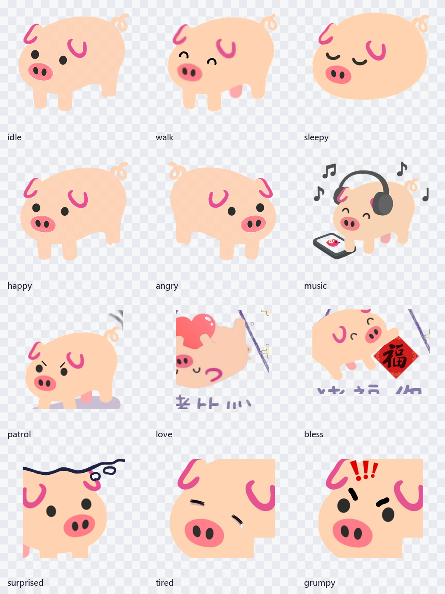

# 谷歌猪桌宠

根据 `D:\Downloads\谷歌猪` 中的 12 张图片素材制作的 Windows 桌宠。
界面和交互按 iOS 应用标准设计，运行时不需要服务器，也不会上传任何内容。

主体颜色保留素材原本的粉色和粉色点缀，并加入了
咖啡、音符、睡眠、爱心和闪光等开放许可装饰道具。

高质量透明渲染使用 Qt 的透明无边框窗口，逐像素 alpha 不会产生紫红色边缘，
并且系统托盘、控制面板和动画都由 Qt 驱动；如果没有安装运行依赖，会自动回退。

移动动画改为飘动模式：使用静止高清猪身，配合柔和的上下浮动和水平漂移，
不再切换腿部姿态，因此没有白噪点、马赛克或面部闪烁。



## 启动

双击：

```
启动谷歌猪.bat
```

如果本机没有 `pythonw`，脚本会自动改用 `python` 启动。

## exe 与桌面快捷方式

已经打包好的单文件版本位于：

```
dist\谷歌猪桌宠.exe
```

这个 exe 内含全部图片素材，可以直接复制发给没有 Python 的 Windows 电脑。

重新打包：

```
打包exe.bat
```

创建或重新创建桌面快捷方式：

```
创建桌面快捷方式.bat
```

## 操作

| 操作 | 效果 |
| --- | --- |
| 单击谷歌猪 | 切换开心、生气、听歌、睡觉等表情 |
| 双击 | 进入听歌状态 |
| 拖动 | 把桌宠移动到桌面任意位置 |
| 右键 | 打开 iOS 风格控制中心 |
| `Space` | 触发一次互动 |
| `M` | 听歌 |
| `S` | 睡觉 |
| `Esc` | 保存位置和设置 |

控制中心支持：

- 飘动模式（默认开启，可随时关闭）；
- 固定动作选择，可让桌宠一直保持待机、开心、巡视、比心、祝福、惊讶、
  困意或不爽等姿态；
- 始终置顶；
- 随机小动作；
- 深色/浅色外观；
- 小、中、大三种尺寸；
- 快速动作：摸摸、睡觉、听歌、生气、回角落；
- 开机启动。

系统托盘菜单也可以直接切换飘动模式。

固定动作可以在控制中心的下拉框里选择，也可以从系统托盘的固定动作菜单
里切换。选择自动切换以外的动作后，桌宠不会再随机改变表情。

互动时会在桌宠右侧出现 Twemoji 装饰道具，例如听歌时的音符、睡觉时的
睡眠符号、开心时的爱心、生气时的怒气符号。开心和生气状态使用全身姿态叠加
倾斜、弹跳或轻微抖动，不再使用有硬裁边的局部表情图。第三方素材许可说明见
`THIRD_PARTY_NOTICES.md`。

设置和位置保存在：

```
%LOCALAPPDATA%\GooglePigPet\settings.json
```

## 素材转换

原始素材不是透明 PNG。`tools\prepare_assets.py` 会进行：

1. 按状态裁切；
2. 去掉粉色或白色背景；
3. 清除来源水印；
4. 处理透明边缘；
5. 生成 `small`、`medium`、`large` 三套透明 PNG；
6. 保留素材原粉色；
7. 生成图标和预览图 `assets\preview_sheet.png`。

只有重新生成素材时才需要 Pillow：

```
python -m pip install pillow
```

然后双击：

```
重新生成素材.bat
```

## 项目结构

```
谷歌猪桌宠/
├─ app_qt.py              Qt 透明桌宠主程序
├─ app.py                 Tkinter 备用版本
├─ 启动谷歌猪.bat
├─ 安装依赖.bat
├─ 打包exe.bat
├─ 重新生成素材.bat
├─ assets/
│  ├─ manifest.json       素材清单
│  ├─ icon.ico
│  ├─ preview_sheet.png
│  ├─ qt_preview.png
│  ├─ states/
│     ├─ small/
│     ├─ medium/
│     └─ large/
└─ tools/
   └─ prepare_assets.py
```

## 运行环境

- Windows 10 / Windows 11；
- Python 3.9 或更高版本；
- Tkinter（Python 官方 Windows 安装包默认包含）；
- 高质量透明渲染需要 `PySide6`、`Pillow` 和 `numpy`；
- 重新生成素材时需要 Pillow。

首次使用可以双击：

```
安装依赖.bat
```

然后双击 `启动谷歌猪.bat`。
